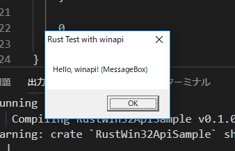

# RustWin32ApiSample
Cプラぷらーとしては試すしかないRust。C++に匹敵する速度で動作するRustは、IoT時代の省電力低スペックPC上で動作する分散アプリケーションには最適の選択肢かもしれません。知らんけど。

## 環境構築
cargo install racer
など。

## 実行結果

## 参考
https://qiita.com/maosec/items/335de0249799f0d5e286  
(2018/9/6)これプラス「rustup override set nightly」が必要だと思います。

## ミス
win32api じゃなくて winapi でしたorz
